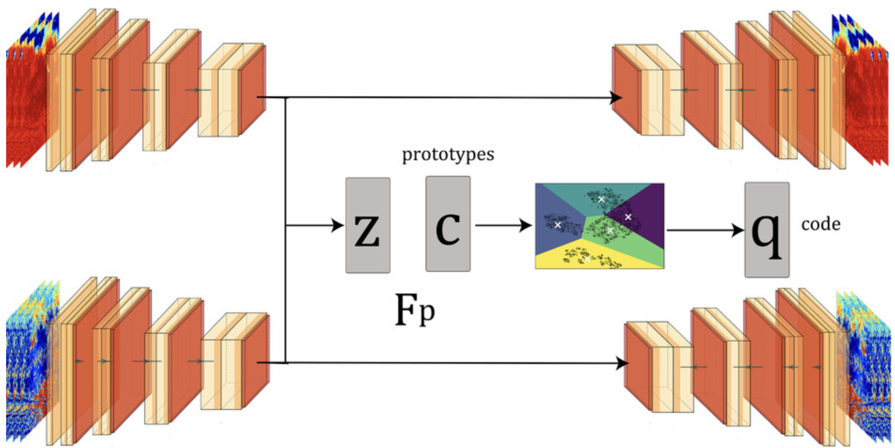
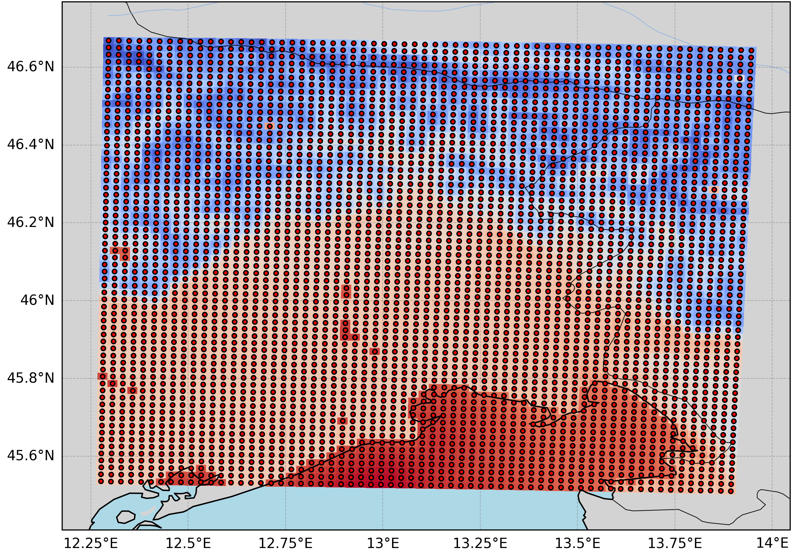
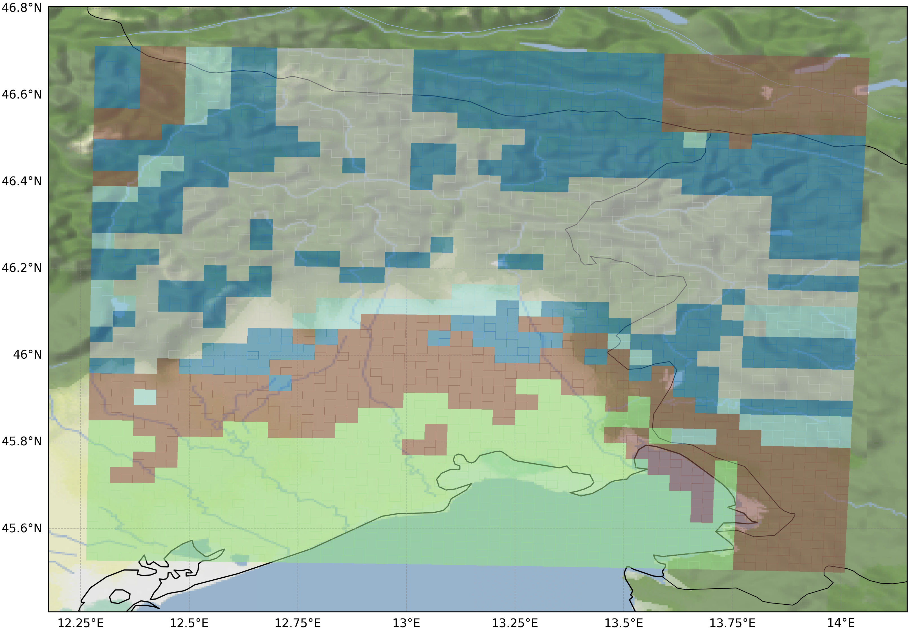
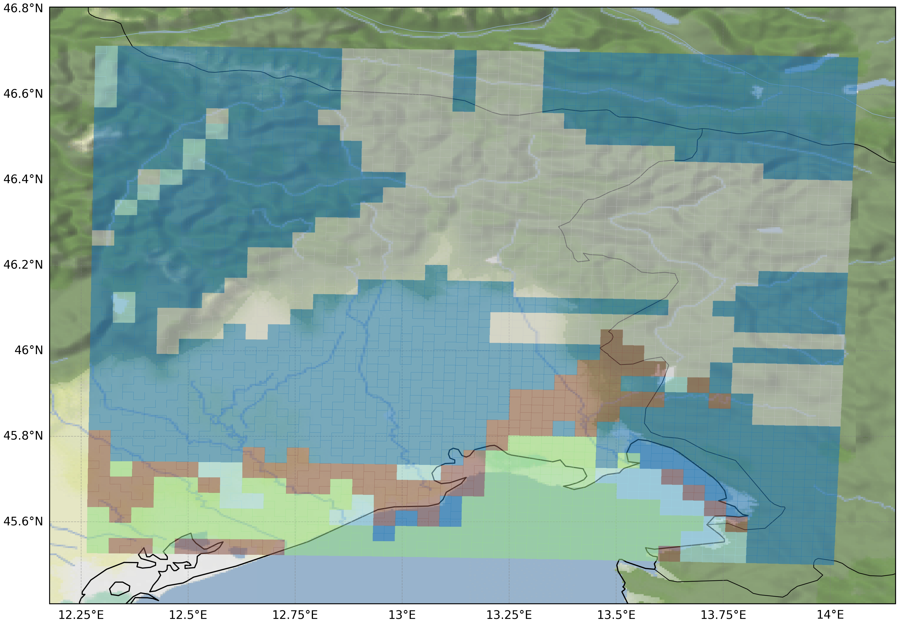
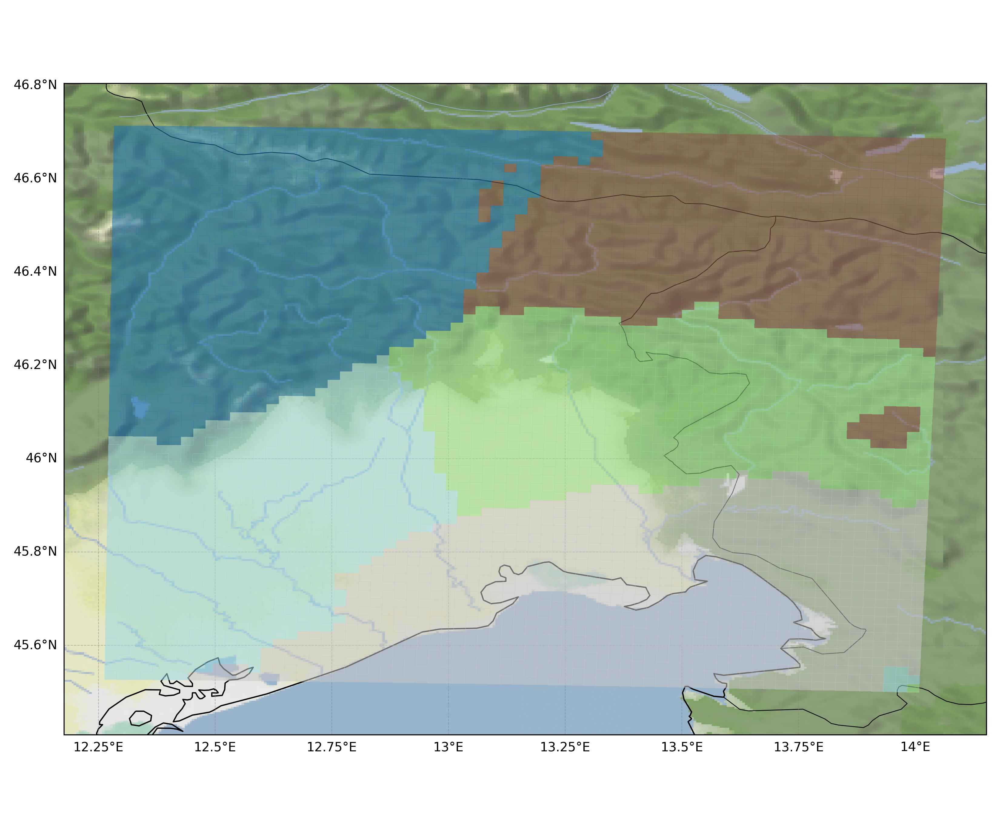
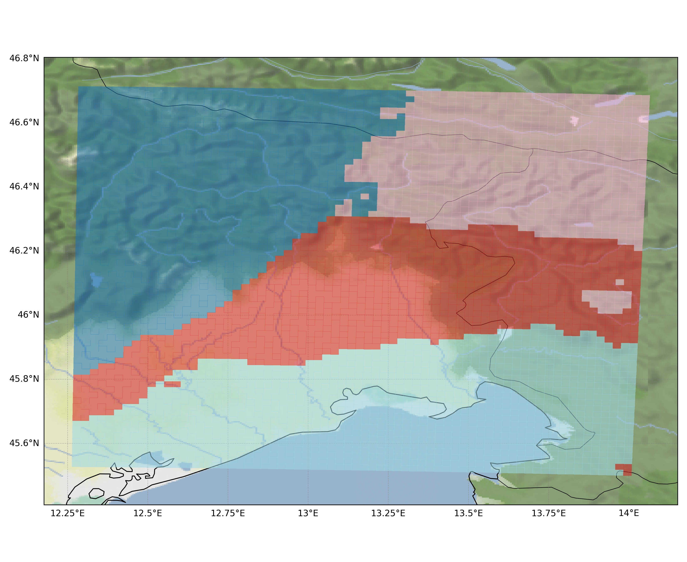
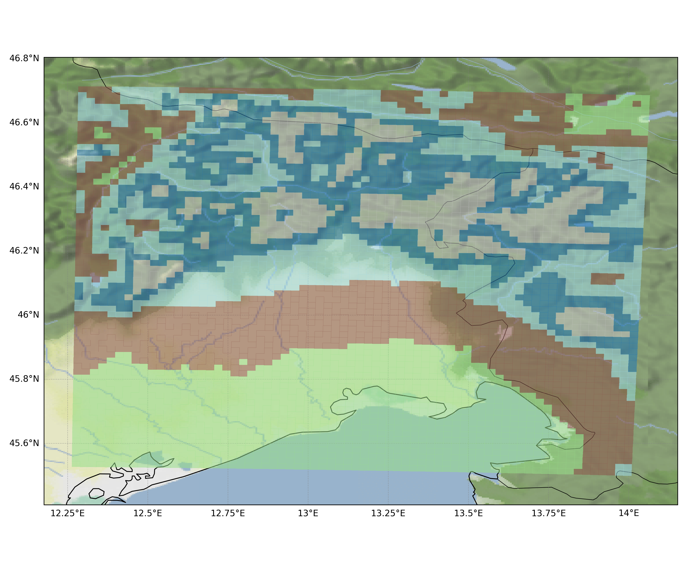
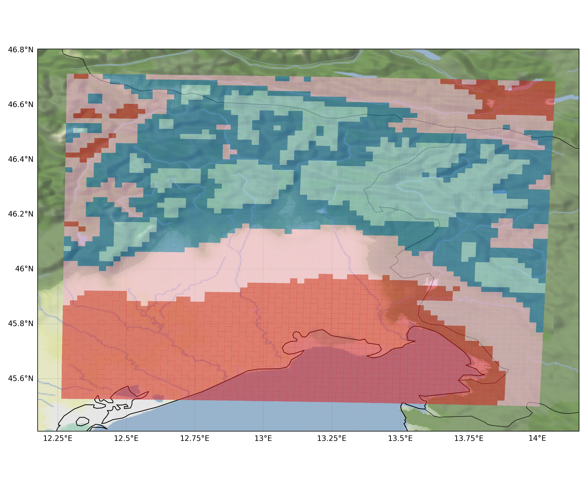

# Unsupervised Learning project
### Marco Zampar - SM3800032
January 13, 2026

---

# Clustering Auto-Encoder

This project is aimed at implementing the Clustering Autoencoder (CAE), a method proposed in: **Identifying Climate Patterns Using Clustering Autoencoder Techniques** [1] 

---

# Model architecture



The idea is to add to the Convolutional Autoencoder a **single-layer perceptron** $F_p$ to map the latent representation $z$ into $\mathbb{R}^n$ (the space where the **cluster prototypes** $c$ are defined) and to return a probability distribution over the possible clusters proportional to the scalar product $F_p(z) \cdot c$. 


---


<!-- _class: small -->

<style>
section.small {
  font-size: 1.55em;
}
</style>


Given a data point $x$, the $CAE$ encodes the data in a **latent space** through an **encoder**, this latent representation is flattened into a vector $z \in \mathbb{R}^m$.

The latent representation $z$ is passed through the **decoder**, the reconstructed $\hat{x}$ is obtained and the **reconstruction loss** $RMSE(x,\hat{x})$ is computed.

The latent representation $z$ is also passed through a **single-layer perceptron** with a **ReLu** activation function to map it into $\mathbb{R}^n$. Given a set of $k$ (trainable) **cluster prototypes**, the probability distribution of a point $x$ of belonging to a given cluster is computed passing the scalar product $F_p(z) \cdot{} c$ through a **softmax layer**, with temperature parameter $\tau$ that regulates the probability of the most probable cluster, (the lower $\tau$, the higher the probabiltiy of the most probable cluster).

$$

p(k_i)
=
\frac{\exp\!\left(\dfrac{F_p(z)\cdot c_i}{\tau}\right)}
{\sum_{j=1}^{k} \exp\!\left(\dfrac{F_p(z)\cdot c_j}{\tau}\right)}

$$

where $p(k_i)$ is the probability that point $x$ belongs to the $i$-th cluster.

---

<!-- _class: small -->

<style>
section.small {
  font-size: 1.55em;
}
</style>

Target cluster assingments are obtained with the iterative **Sinkhorn-Knopp algorithm** [2][3]: given a batch of $B$ samples, it assings a probability distribution over clusters to each data point in an efficient, non trivial and balanced way, with a smoothing parameter $\epsilon$.

Let us define: $Z \in \mathbb{R}^{B \times n}$, the latent representation of the points of the batch, passed through $F_p$; $C \in \mathbb{R}^{n \times k}$, the cluster prototypes; $Q \in \mathbb{R}^{k \times B}$, the cluster probability distribution for each data point in the batch.

The matrix $Q = \operatorname{Diag}(\mathbf{u})\, \exp\!\left( \frac {\mathbf{C}^{\top} \mathbf{Z}} {\epsilon} \right)\,
\operatorname{Diag}(\boldsymbol{\upsilon})$, where $u$ and $v$ are computed by renormalization in $\mathbb{R}^k$ and $\mathbb{R}^B$ through the Sinkhorn–Knopp algorithm (iterative row-normalisation and column-normalisation), is the solution to the problem: 

$$

\max_{Q \in \mathcal{Q}} \; \operatorname{Tr}\!\left( Q^{\top} C^{\top} Z \right) + \varepsilon H(Q)

$$

where $H$ is the entropy function and the possible matrices $Q \in \mathcal{Q}$ satisfy the conditions: $Q \mathbf{1}_B = \frac{1}{K} \mathbf{1}_K, Q^\top \mathbf{1}_K = \frac{1}{B} \mathbf{1}_B$, allowing a balanced cluster assingment over the batch, with no collapse of assingments to a single cluster.


---

```
def sinkhorn(scores, epsilon=0.05, sinkhorn_iterations=3):
    # scores: (B, feature_dim)
    with torch.no_grad():

        Q = torch.exp(scores / epsilon).t()  # K x B
        B = Q.shape[1]
        K = Q.shape[0]

        Q /= torch.sum(Q)

        for _ in range(sinkhorn_iterations):
            # row normalization
            Q /= torch.sum(Q, dim=1, keepdim=True)
            Q /= K

            # column normalization
            Q /= torch.sum(Q, dim=0, keepdim=True)
            Q /= B

        Q *= B
        return Q.t()  # back to (B, K)
```
---

The **clustering loss** is computed via **cross-entropy** between the target assingment distributions and predicted assingment distributions.

The final loss is the **weighted sum** of the reconstruction and clustering loss terms. When we optimise it by Gradient descent, we optimse both the encoder-decoder architectures, the cluster prototypes and the parameters of the single-layer perceptron $F_p$.

The encoder and decoder architectures, since we are working with 3D data (lat x lon x time), are **Convolutional Neural Networks**. We kept a similar structure of the CNN encoder and decoder wrt the orignal paper.

---


<!-- _class: small -->

# Experiment

<style>
section.small {
  font-size: 1.55em;
}
</style>

Are there any climatological regional patterns in the **Friuli Venezia Giulia** region that can be found through a clustering technique?

We work with a reanalysis of 2km spatial resolution (68x66=4488 gridpoints) and hourly temporal resolution, we analyse more than 20 years (2001-2023) of **precipitation** (mm/h), working with **monthly means**.
The period (2001-2017) is taken as training set and the period (2018-2023) as test set.

When talking about **clusters**, we refer to a partition of the gridpoints based on similar **climatologial patterns**.

<!--  -->


---

<!-- _class: small -->

<style>
section.small {
  font-size: 1.0em;
}
</style>

# Data and Training

After rescaling the data (min-max scaling on a monthly basis) and extracting patches of shape 8x8 (64 gridpoints) moving the patch with a **stride** of 2, the monthly cumulatives of each year are stacked one on the other, to get a 3D-tensor of shape **8x8x12**.

We get a training set of **15810** patches and a test set of **5580** patches.

Each grid cell is assigned to the **most frequent cluster** of the patches that contain that grid cell.

After some tuning of the parameters, we found a nice configuration (different from the one of the paper):

- $\alpha = 0.5$
- $\tau = 0.05$
- $\epsilon = 0.09$
- batch size $= 512$
- latent dimension = $512$
- prototypes dimension = $512$
<!-- - learning rate $= 10^{-4}$ -->

---


---


<style>
table, tr, td {
  border: none !important;
  border-collapse: collapse !important;
}
</style>

<table>
<tr>
<td width="50%">

<strong>Training clustering</strong>
<div style="height:0.3em;"></div>


</td>
<td width="50%">

<strong>Test clustering</strong>
<div style="height:0.3em;"></div>


</td>
</tr>
</table>

---

<!-- _class: small -->

<style>
section.small {
  font-size: 1.55em;
}
</style>

# Comparison with other methods: k-medoids clustering

<!-- Maybe you shuould compare with periods of train and test set! -->

A different method was tested: **k-medoids**. This was chosen because, despite its simplicty, it allows to use a generic distance matrix.
Many number of clusters were tested, and since the results can be easily visually inspected, the choice of the number of clusters was done looking at the cluster plots and at the Scree test.
2 distances were used: the **Pearson correlation coefficient** between each pair of monhtly time series ($d_{ij} = 1 - \rho$) and the **Kolmogorov-Smirnov distance** between the **Empirical Cumulative Distribution Functions** of each pair of samples ($d_{ij} = D_{KS}(F_i , F_j)$). 

The **KS distance** between two cumulative distribution functions (CDFs) \(F(x)\) and \(G(x)\) is defined as:

$$
D_{KS} = \sup_x \, | F(x) - G(x) |
$$

where $\sup_x$ denotes the maximum absolute difference between the two CDFs.


---

<style>
table, tr, td {
  border: none !important;
  border-collapse: collapse !important;
}
</style>

<table>
<tr>
<td width="50%">

<strong>Correlation-based</strong>
<div style="height:0.3em;"></div>
<!--  -->


</td>
<td width="50%">

<strong>KS-based</strong>
<div style="height:0.3em;"></div>
<!--  -->


</td>
</tr>
</table>

---

In the first case we find homogenous-in-space clusters, probably due to the fact that precipitation shows high **spatial autocorrelation**.

In the second case, since KS distance doesn't take into account the temporal correlation of the data, but only the distance between its **ECDFs**, we can see that the results seem to have a physical meaning and are probably driven by the orography.

The number of clusters is chosen to be **4**. This was chosen looking at the Scree test and at the KS distance-based cluster plots, promoting interpretability and physical meaning of the clusters.

<!-- inertia: Sum of distances of samples to their closest cluster center.-->

---

# Scree test

<style>
table, tr, td {
  border: none !important;
  border-collapse: collapse !important;
}
</style>

<table>
<tr>
<td width="50%">

<strong>Correlation-based k-medoids</strong>
<div style="height:0.3em;"></div>


</td>
<td width="50%">

<strong>KS-based k-medoids</strong>
<div style="height:0.3em;"></div>


</td>
</tr>
</table>


---

# Pros and cons of the CAE

<!-- _class: small -->

<style>
section.small {
  font-size: 0.55em;
}
</style>

<table style="width:100%; border-collapse:collapse;">
<tr>
<td style="width:50%; vertical-align:top; border:none; padding-right:20px;">

### Strengths
- Takes spatial autocorrelation into account with 8×8 
pixel patches, but pools together different years of the same patch, allowing robust yet non-dominant spatial patterns,
combining correlation and KS-distance based approaches.
- Scales well to large datasets.
- Fuzzy clustering can be obtained by combining assignments of the same patch.

<!-- - Leverages more information: k-medoids condenses all information 
into a single distance matrix, 
while CAE uses information coming from different years.
-->

</td>
<td style="width:50%; vertical-align:top; border:none; padding-left:20px;">

### Weaknesses
- Requires a GPU.
- Overfitting: model may not generalize well.
- Unreliable results: training sometimes fails to converge and it is initialization dependent.
- Parameter tuning (tau and epsilon) is non-obvious: using paper parameters didn't work.
- Number of clusters is a parameter.

</td>
</tr>
</table>


---

<!-- _class: small -->

<style>
section.small {
  font-size: 1.55em;
}
</style>

# Conclusions and further experiments

In this brief presentation, we outlined the main characteristics of the Clustering Auto-Encoder, its pros and cons and the differences wrt the outputs of other clustering techniques.

In the future, we can work on these aspects:

- make the model more reliable and stable, facing the overfitting and initialisations depedendance issues;

- apply this technique to a bigger dataset in terms of gridpoints and years or increase the same dataset using a different temporal aggregation strategy, like decades instead of months;

- apply this technique to other meteorological variables, like temperature and relative humidity; 

- apply this technique to the future scenario projections CMIP6 Eurocordex.

---

# Thank you for your attention!

---

# References

1. Kurihana et al., 2024, **Identifying Climate Patterns Using Clustering Autoencoder Techniques**: https://journals.ametsoc.org/view/journals/aies/3/3/AIES-D-23-0035.1.xml

3. Caron et al., 2020, **Unsupervised learning of visual features by contrasting cluster assignments**: https://arxiv.org/pdf/2006.09882

3. Cuturi, 2013, **Sinkhorn distances: Lightspeed computation of optimal transport**: https://arxiv.org/abs/1306.0895


<!--

Tried to solve overfitting reducing the layers in the convolutions but didn't work

Tried to add a normalisation (loss on the weight of the latent representation z), it worked but slows convergence and doesn't fix overfitting

Tried to use leaky relu instead of relu but didn't improve

---
# Bonus: Differences with the original papaer:

The architecture is much similar, but since FVG domain is smaller than the one of the paper (CONUS), I used patches of size 8x8, insetad of 16x16.
I didn't like the way in which data were normalised: z score normalisation was applied to each grid point and then the running mean with a window of 3 months was subtracted to deseasonalise.
I think that too much information is lost.
I did something different: I normalised with min max scaling on a monthly basis, i.e taking the max and min monthly cumulative over the entire domain (12 x 2 values) and I applied min max scaling to each gridpoint, based on the month.
Also, the data points passed to my CAE have shape 8x8x12 i.e. all the 12 months of a year are passed together, so that each frame of the 12 channels always represents a fixed month and the AE can better understand the features and the data it gets in input, in the original paper running slices of 3 months were passed, this can be done because deseasonalisation was applied.
Finally, the aim of the paper was to compare the presetn a climatoligcal clusters with future projections scenarios, since I didn't have those data, I only analysed the present.


Something interesting I noticed: the smaller the batch, the higer the clustering loss, probalby due to the sinkhorn knopp algorithm. instead, if i compute the clustering loss directly on the entire traiing dataset, i get loweer values wrt the mean of the losses for each minibatch. the same holds for the validation loss: in the first case, teh clustering loss is lower the the validation clustering loss, in the second not.

---
-->